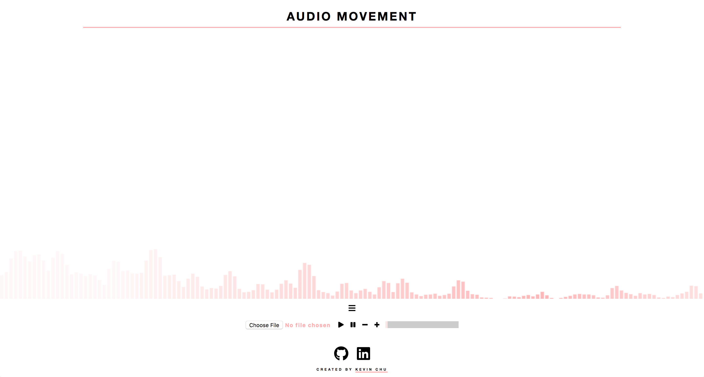

# Audio Movement

[Live Site](https://kchu93.github.io/audio-movement/)

## Overview

Audio Movement is a way for music enthusiasts to see their sounds come to life. Audio Movement will allow users to bring in bring their audio and have a visualization move to their song.

## Features:

In Audio Movement, users are able to:

  * Upload audio of their choice
  * See Visuals react to their music
  * Play with a controller to tune their visual wave lengths
  * Select from a range of colors to change visual output
  * Adjust their sound with audio controller

## How To User:

  * Upload song of choice or play with sample song
  * Adjust song volume to user's preference
  * Open drop down menu for visual controller
  * Set sliders to adjust wave length height and width
  * Select up to 4 gradient colors for wavelength
